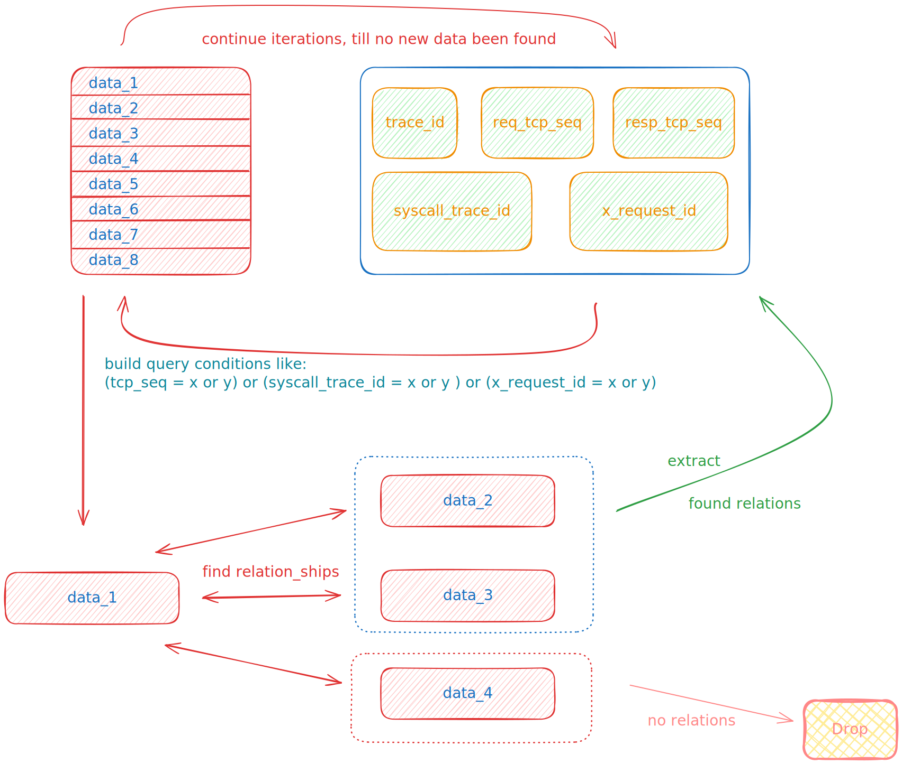
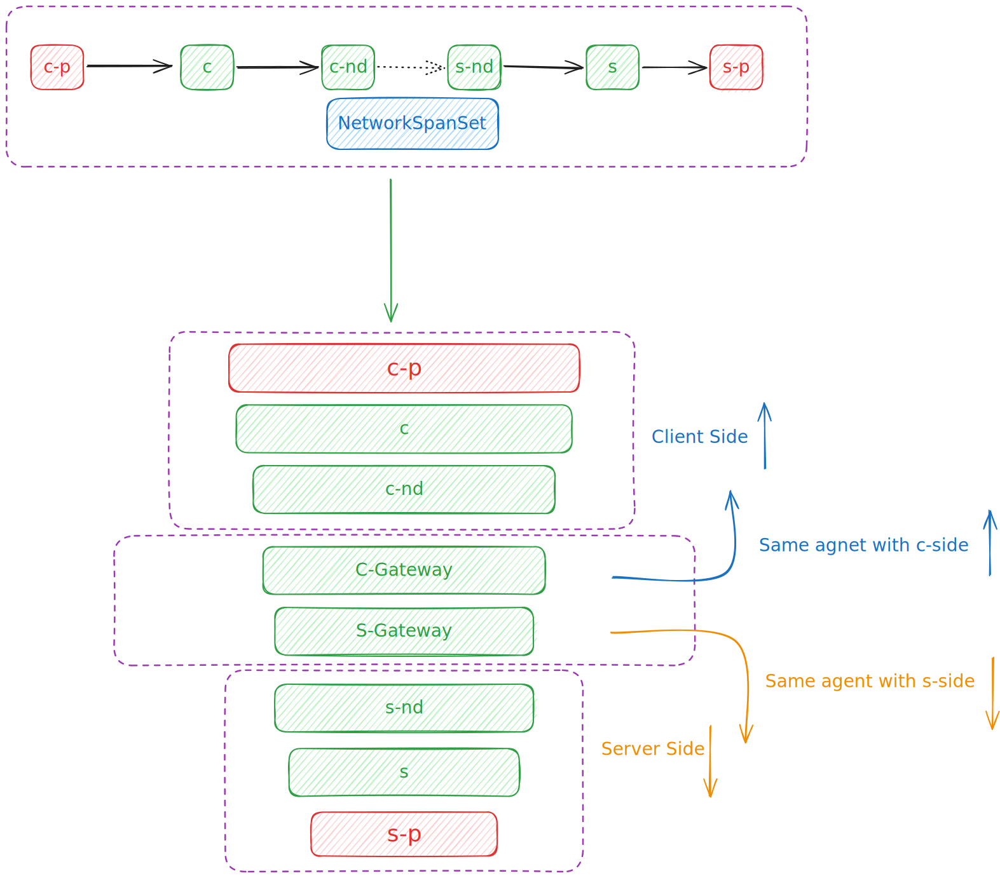
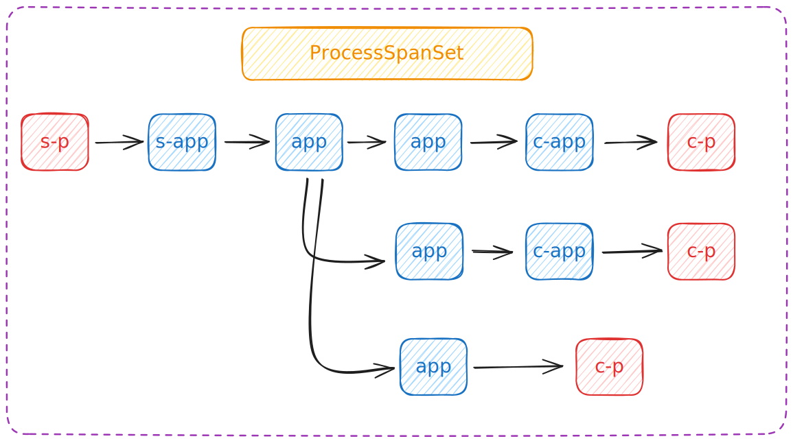
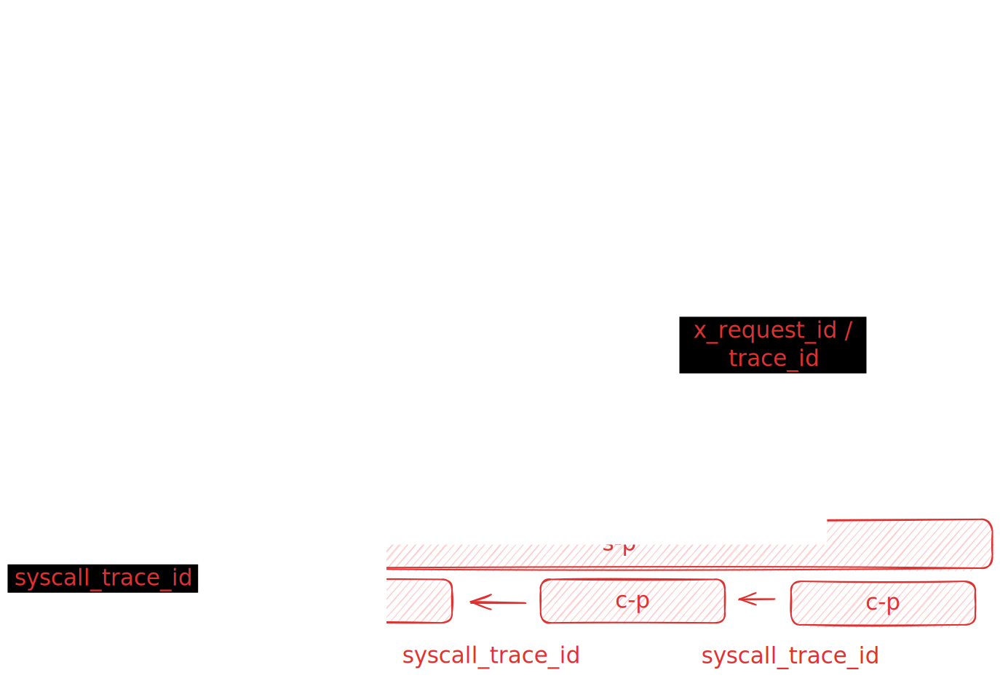
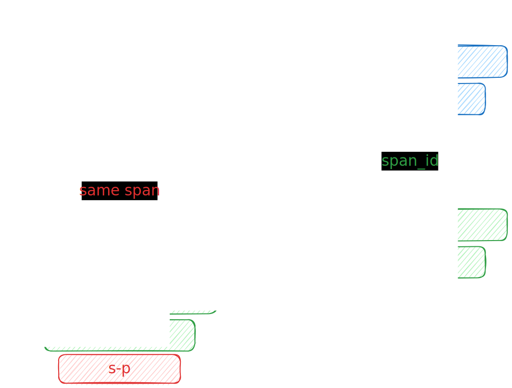
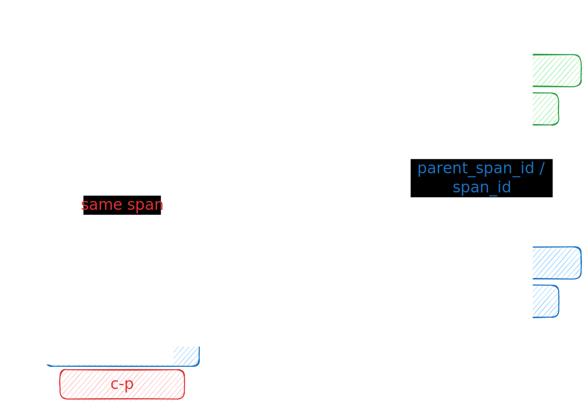
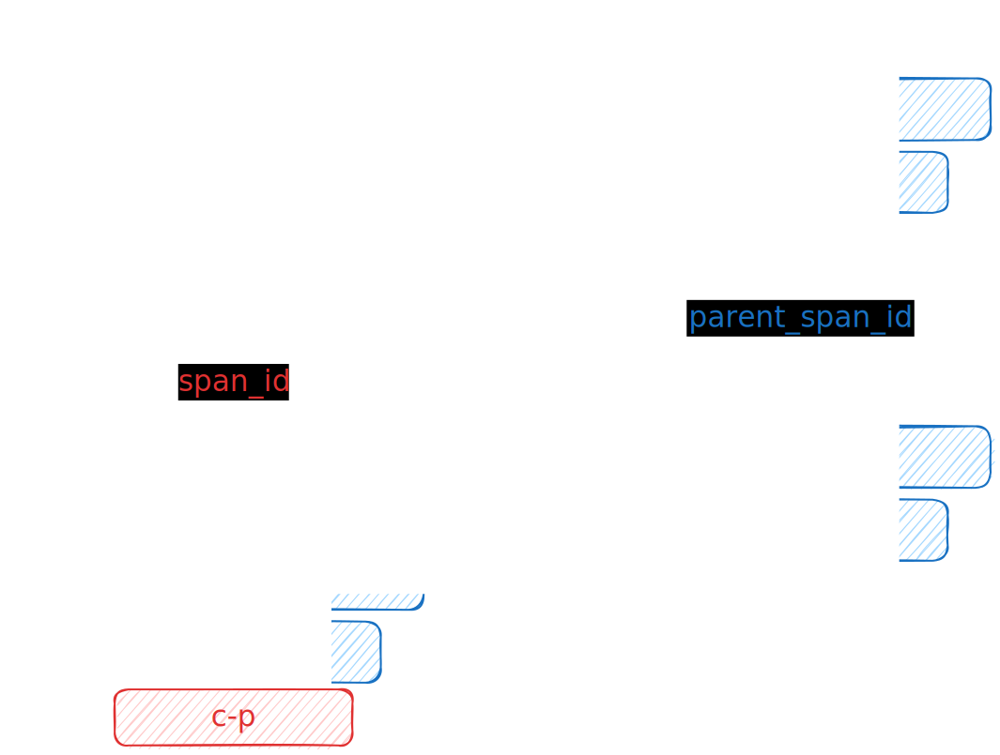
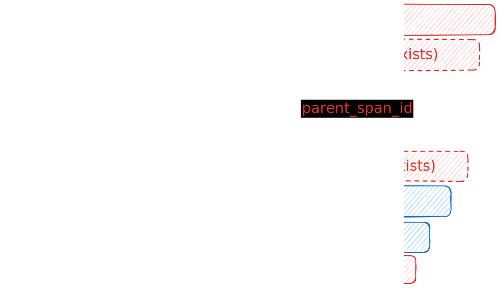
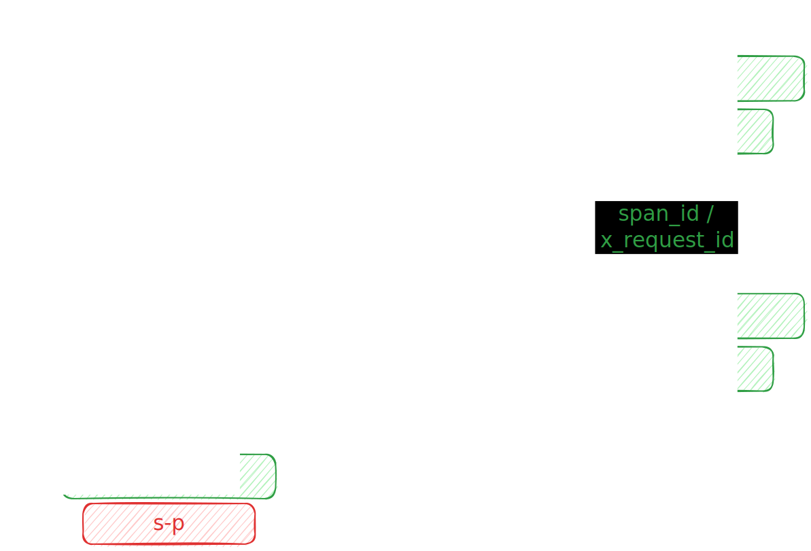
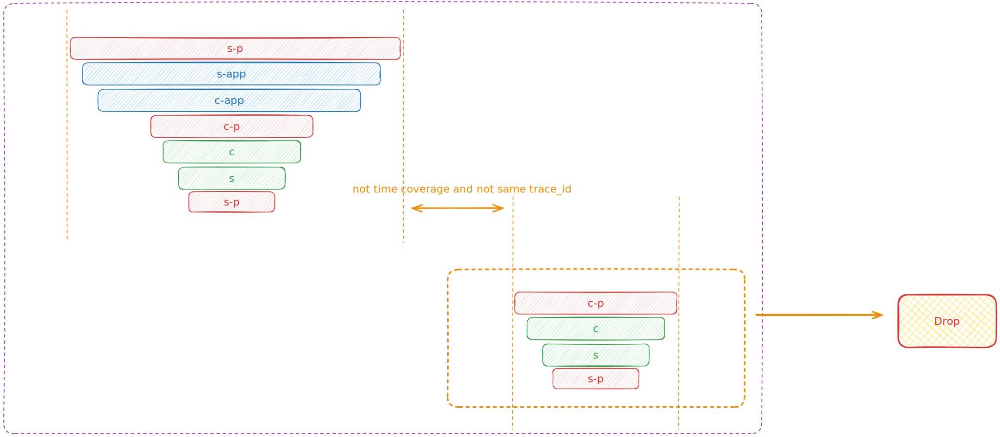

# DeepFlow App 逻辑设计

## 术语

| 名称 | 含义 |
| -- | -- |
| Request / Span / Flow | 大部分情况下互相替代的等价概念，可以粗浅理解为一个请求在不同视角下的描述或一个请求经过不同处理过程后的结果，其中在某些特殊场景下，单向的 Flow 要通过[merge_flow](https://github.com/deepflowio/deepflow-app/blob/v6.6.3/app/app/application/l7_flow_tracing.py#L1845) 之后才能成为 Request / Span |
| ProcessSpanSet | 一个进程内对一个入请求的处理过程 |
| NetworkSpanSet | 一个流在网络中的穿越过程 | 
| Service | ProcessSpanSet 按照 AutoService 聚合后的结果 |
| AutoService | DeepFlow 匹配到的服务资源信息，可能是一个集群/K8s 服务/子网...是匹配到的实例资源的抽象集合 |
| ObservationPoint | DeepFlow 定义的 Span/Flow 的观测点，在代码中也称 TapSide(统计位置)|

## 计算逻辑

构建火焰图需要经过几个阶段：

1. 搜索：获取可被追踪关联的请求数据。
2. 合并：将单向的请求合并成会话。
3. 排序：对这些请求数据，按符合物理发生顺序的先后进行排序。
4. 裁剪并统计指标。

### 搜索

搜索过程会发生多次迭代，通过上一轮的迭代结果，生成下一轮的条件，最终直到无法迭代出新的数据或达到最大迭代次数限制[max_iteration](https://github.com/deepflowio/deepflow-app/blob/v6.6.3/app/app.yaml#L27) 而停止。

搜索查询过程基于「入口 Flow」而开始：
1. 以入口 Flow 作为搜索对象，进行第一轮迭代，基于 trace_id 获取本 trace 的所有 Flow。[代码位置](https://github.com/deepflowio/deepflow-app/blob/v6.6.3/app/app/application/l7_flow_tracing.py#L253)
2. 基于「2」，获取得到的所有 Flow 的 tcp_seq/syscall_trace_id/x_request_id。[代码位置](https://github.com/deepflowio/deepflow-app/blob/v6.6.3/app/app/application/l7_flow_tracing.py#L230)
3. 基于「3」，构建三组查询条件，即：「req_tcp_seq 相等/resp_tcp_seq 相等」、「syscall_trace_id_request/syscall_trace_id_response 相等」、「x_request_id_0/x_request_id_1 相等」[代码位置](https://github.com/deepflowio/deepflow-app/blob/v6.6.3/app/app/application/l7_flow_tracing.py#L329)
3. 基于「4」，查找符合条件的 Flow，对搜索得到的新的 Flow，重复执行 2-5 步骤。

最后，当迭代停止，即为本次计算追踪出的所有 Flow。

### 合并

合并 Flow 是指由于采集机制或流的机制而发生「Flow 只有请求，或只有响应」的现象，需要尝试合并为一个完整的「会话」。

合并的逻辑见[代码](https://github.com/deepflowio/deepflow-app/blob/v6.6.3/app/app/application/l7_flow_tracing.py#L1845)。

1. 先对所有 Flows 按照 start_time 递增排序。
2. 对所有 Flow，当找到一个 Response，则合并到前置的一个 Request 中。
3. 对 DNS SYS Span，尝试按照 syscall_cap_seq 递增关系将 DNS SYS Span Response 合并到会话中。

### 排序

排序过程要求生成 NetworkSpanSet 与 ProcessSpanSet，并标记内部的父子关系，最后通过 SpanSet 之间两两连接完成排序。

#### 生成 NetworkSpanSet

一个 NetworkSpanSet 由如下 Span 组成：
- 零个或一个 c-p
- 零个或多个信号源为网络类型的 Flow
- 零个或一个 s-p

约束条件：
一个 NetworkSpanSet 具有以下内部关系：[代码位置](https://github.com/deepflowio/deepflow-app/blob/v6.6.3/app/app/application/l7_flow_tracing.py#L982)
- 所有 Span 之间的 TcpSeq 必须相等
- 作为一个 Flow，他们的流信息必须相等：[判断流信息是否相等](https://github.com/deepflowio/deepflow-app/blob/v6.6.3/app/app/application/l7_flow_tracing.py#L911)

内部排序：[代码位置](https://github.com/deepflowio/deepflow-app/blob/v6.6.3/app/app/application/l7_flow_tracing.py#L1233)
- 找到 c-p ，对与它同一个 agent_id 的 Span，按 start_time 递增且 end_time 递减排序
  - 如果没有 c-p，就找 c；如果没有 c，就找 c-nd；如果都没有，就放弃客户端侧
- 找到 s-p，对与它同一个 agent_id 的 Span，按同样策略排
- 对于其他的 Span，按 start_time 递增且 end_time 递减排

- 最后得到的排序结果是：客户端 => 其他 => 服务端

#### 生成 ProcessSpanSet

一个 ProcessSpanSet 由如下 Span 组成：
- 零个或一个 s-p
- 零个或多个 s-app、app、c-app，它们之间根据 span_id 和 parent_span_id 的关系形成一棵树
  - 且树根的 parent_span_id 指向 s-p 的 span_id
- 零个或多个 c-p

约束条件：
- 上述所有 Span 的进程信息必须相等 [代码位置](https://github.com/deepflowio/deepflow-app/blob/v6.6.3/app/app/application/l7_flow_tracing.py#L2175)
- 上述 SYS Span 的时间必须有交迭：s-p 的时间必须完全覆盖 c-p，因为它们不存在时差问题 [代码位置](https://github.com/deepflowio/deepflow-app/blob/v6.6.3/app/app/application/l7_flow_tracing.py#L1723)
- 当没有 parent_span_id 信息做辅助时，c-p 和 s-p 必须能通过 syscall_trace_id 或 x_request_id 找到关联性 [代码位置](https://github.com/deepflowio/deepflow-app/blob/v6.6.3/app/app/application/l7_flow_tracing.py#L1727)
  - 较松散的关联：当 s-p 与 c-p 具有同一个进程、s-p 的时间完全覆盖 c-p、且具有同一个 trace_id 时，可以认为这个 s-p 与 c-p 有关联 [代码位置](https://github.com/deepflowio/deepflow-app/blob/v6.6.3/app/app/application/l7_flow_tracing.py#L1743)

如何构建 ProcessSpanSet：
1. 将所有 APP Span 按 auto_instance 划分为 ProcessSpanSet [代码位置](https://github.com/deepflowio/deepflow-app/blob/v6.6.3/app/app/application/l7_flow_tracing.py#L2103)
2. 根据每个 ProcessSpanSet Root Span 的 parent_span_id 和 s-p 的 span_id 相等关系，将 s-p 设置为 Root Span 的 Parent [代码位置](https://github.com/deepflowio/deepflow-app/blob/v6.6.3/app/app/application/l7_flow_tracing.py#L1657)
    1. 当树根 Span 没有 parent_span_id 时，根据 ProcessSpanSet 中的 c-p 的 syscall_trace_id 与 s-p 的 syscall_trace_id 相等关系、x_request_id 相等关系、s-p 时间覆盖 c-p 时间关系将 s-p 设置为 Root Span 的 Parent [代码位置](https://github.com/deepflowio/deepflow-app/blob/v6.6.3/app/app/application/l7_flow_tracing.py#L1669)
3. 根据每个 ProcessSpanSet 所有叶子 Span 的 span_id 和 c-p 的 span_id 相等，将 c-p 设置为 ProcessSpanSet 叶子 App Span 的 Child，并作为本 ProcessSpanSet 的新叶子节点 [代码位置](https://github.com/deepflowio/deepflow-app/blob/v6.6.3/app/app/application/l7_flow_tracing.py#L1687)

4. 对剩余空闲的 s-p，它自己作为一个独立的 ProcessSpanSet，并尝试将剩余空闲的 c-p 上挂
    1. 按照「进程相等、syscall_trace_id/x_request_id 匹配、s-p 时间必须覆盖 c-p」的条件挂 [代码位置](https://github.com/deepflowio/deepflow-app/blob/v6.6.3/app/app/application/l7_flow_tracing.py#L1723)
    2. s-p 与 c-p 之间，只有「syscall_trace_id_request 相等 或 syscall_trace_id_response 相等」两种同侧相等关系 [代码位置](https://github.com/deepflowio/deepflow-app/blob/v6.6.3/app/app/application/l7_flow_tracing.py#L1732)
    3. s-p.x_request_id_0 == c-p.x_request_id_0: 透传 x_request_id [代码位置](https://github.com/deepflowio/deepflow-app/blob/v6.6.3/app/app/application/l7_flow_tracing.py#L1739)
    4. s-p.x_request_id_1 == c-p.x_request_id_0: 注入 x_request_id

5. 遍历每一个空闲的 c-p，它自己就是一个 ProcessSpanSet

总体过程简单来讲，就是从 APP Span 聚堆开始，然后吸引 SYS Span，最后剩下的 s-p Span 自己成堆并关联 c-p。

#### SpanSet 连接

SpanSet 之间两两互相连接，并标记他们之间的 Parent 关系。总共有如下五种连接的场景，依次从上到下按优先级来挂。其中，1/2/3/4 包含如下限制条件：

约束条件：
- 避免「同组 SpanSet 」首尾的 Span 满足上述 1.2. 条件发生首尾互连，限制满足条件的两个 Span 不能是同一个 SpanSet [代码位置](https://github.com/deepflowio/deepflow-app/blob/v6.6.3/app/app/application/l7_flow_tracing.py#L2319)
- 避免「同一个 span_id 穿越网关不变性」导致排序错误，限制满足条件的两个 Span 里，作为 Parent 的 Span 时延要大于 Child [代码位置](https://github.com/deepflowio/deepflow-app/blob/v6.6.3/app/app/application/l7_flow_tracing.py#L2327)

1. ProcessSpanSet 的每个叶子 Span 尝试下挂 NetworkSpanSet
- ProcessSpanSet 的叶子 Span _id 等于 NetworkSpanSet 的首个 Span，即二者共享一个 c-p，不需要做额外处理 [代码位置](https://github.com/deepflowio/deepflow-app/blob/v6.6.3/app/app/application/l7_flow_tracing.py#L2327)
- ProcessSpanSet 的叶子 Span span_id 等于 NetworkSpanSet 的首个 Span 的 span_id，肯定都没有 c-p，构建父子关系 [代码位置](https://github.com/deepflowio/deepflow-app/blob/v6.6.3/app/app/application/l7_flow_tracing.py#L2337)

2. ProcessSpanSet 的树根 Span 尝试上挂 NetworkSpanSet
- ProcessSpanSet 的树根 Span _id 等于 NetworkSpanSet 的最后一个 Span 的 _id，即二者共享一个 s-p，不需要做额外处理 [代码位置](https://github.com/deepflowio/deepflow-app/blob/v6.6.3/app/app/application/l7_flow_tracing.py#L2363)
- ProcessSpanSet 的树根 Span span_id 等于 NetworkSpanSet 的最后一个 Span 的 parent_span_id 或 span_id，肯定都没有 s-p，构建父子关系 [代码位置](https://github.com/deepflowio/deepflow-app/blob/v6.6.3/app/app/application/l7_flow_tracing.py#L2364)

3. 一个 ProcessSpanSet 的剩余叶子节点 Span 尝试下挂另一个 ProcessSpanSet 的空闲树根 Span
- ProcessSpanSet 的叶子 Span _id 等于另一 ProcessSpanSet 的首个 Span 的 _id，即二者共享一个 c-p，不需要额外处理 [代码位置](https://github.com/deepflowio/deepflow-app/blob/v6.6.3/app/app/application/l7_flow_tracing.py#L2405)
- ProcessSpanSet 的叶子 Span span_id 等于另一 ProcessSpanSet 的首个 Span 的 parent_span_id 或 span_id，肯定都没有 c-p [代码位置](https://github.com/deepflowio/deepflow-app/blob/v6.6.3/app/app/application/l7_flow_tracing.py#L2406)

4. 一个 ProcessSpanSet 的空闲树根，尝试连接到其他 ProcessSpanSet 中
- ProcessSpanSet 的树根 Span 的 parent_span_id 等于另一 ProcessSpanSet 的 Span 的 span_id，即存在父子关系 [代码位置](https://github.com/deepflowio/deepflow-app/blob/v6.6.3/app/app/application/l7_flow_tracing.py#L2432)

5. 两个一侧空闲的 NetworkSpanSet 尝试直接连起来（例如没有 SYS Span 的场景，即没有开启 eBPF 能力）
- 一个 NetworkSpanSet 的结尾 Span x_requset_id_0/1 匹配另一个 NetworkSpanSet 的开头 Span 的 x_request_id_0/1
  -  如果 x_request_id_0/1 对应相等，即 lhs.x_request_id_0 == rhs.x_request_id_0 || lhs.x_request_id_1 == rhs.x_request_id_1，要求前者所有 Span 的最小 response_duration 比后者的最大值要大，由于 NetworkSpanSet 已经过排序，即比 NetworkSpanSet 的首个 Span 的 response_duration 大即可 [代码位置](https://github.com/deepflowio/deepflow-app/blob/v6.6.3/app/app/application/l7_flow_tracing.py#L2465)
    - 比较极端的情况：多个 NetworkSpanSet 满足这个要求，意味着有多个网关做 x_request_id 透传，这个极端的情况通过「按 response_duration 大小逆序依次尝试挂空闲的 NetworkSpanSet」，即按 response_duration 大小决定优先级，越接近的越有可能是「上一跳」[代码位置](https://github.com/deepflowio/deepflow-app/blob/v6.6.3/app/app/application/l7_flow_tracing.py#L2484)
    - 如果 x_request_id_0 等于 x_request_id_1，无额外要求，意味着中间有个网关做 x_request_id 注入，直接匹配挂接
  - 一个 NetworkSpanSet 的结尾 Span span_id 等于另一个 NetworkSpanSet 的开头 Span 的 span_id [代码位置](https://github.com/deepflowio/deepflow-app/blob/v6.6.3/app/app/application/l7_flow_tracing.py#L2480)
    - 同时要求前者所有 Span 的最大 response_duration 比后所有 Span 的最小值要大，与 x_request_id_0/1 对应相等的场景处理办法完全相同

### 裁剪

裁剪是排序的后续清理步骤 ，避免因为错误的关联而产生了错误的追踪结果。

裁剪原因：如果 tcp_seq / syscall_trace_id 被重用，因应用部署在大规模的机器集群上，如果网络流量过大，tcp_seq 绕回重用的可能性也会随之增加，为了避免关联出错误的 Flow，需要做裁剪。

裁剪目标：当排序完成后，如果整个 Span 集合存在多棵树，即存在「多个 Root」，则要对这些树做裁剪，去掉不符合预期的树

裁剪条件：
1. 同一个 trace_id 的 Span 不裁剪，认为他们一定是「同一个追踪」的 Span [代码位置](https://github.com/deepflowio/deepflow-app/blob/v6.6.3/app/app/application/l7_flow_tracing.py#L2666)
2. 如果发生了关联关系不裁剪，例如：一组 Span 与另一组 Span 通过 x_request_id 关联，则不会发生裁剪
3. 「追踪」是以「某个 Span」作为入口发生的，可以认为「入口 Span」所在的树一定是结果所需的，所以这棵树不会被裁剪。[代码位置](https://github.com/deepflowio/deepflow-app/blob/v6.6.3/app/app/application/l7_flow_tracing.py#L2619)

裁剪过程：
1. 先找到「入口 Span」所在的树， 以它作为 Root Tree。[代码位置](https://github.com/deepflowio/deepflow-app/blob/v6.6.3/app/app/application/l7_flow_tracing.py#L2619)
2. 对每棵树，计算它占据的「最小时间」与「最大时间」，并计算与「Root Tree」之间的时间差，不满足[host_clock_offset_us](https://github.com/deepflowio/deepflow-app/blob/v6.6.3/app/app.yaml#L31) 参数设置的树将会被剪枝。[代码位置](https://github.com/deepflowio/deepflow-app/blob/v6.6.3/app/app/application/l7_flow_tracing.py#L2658)

### 统计

最后，基于排序完成的结果，做服务分组与时延统计：

1. 对剪枝完成后剩下的 Span 做时延统计，由上而下地遍历，Parent 减去一级子节点的时延即为自身时延。[代码位置](https://github.com/deepflowio/deepflow-app/blob/v6.6.3/app/app/application/l7_flow_tracing.py#L2564)
2. 对剪枝完成后的 Span ，统计它们出现的所有 AutoService/AppService，并基于「1」中求得的时延，按服务为分组维度，计算每个服务的总时延。[代码位置](https://github.com/deepflowio/deepflow-app/blob/v6.6.3/app/app/application/l7_flow_tracing.py#L2564)
